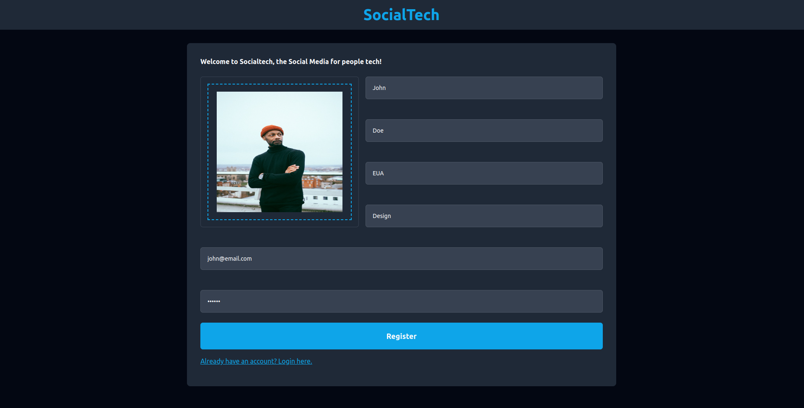
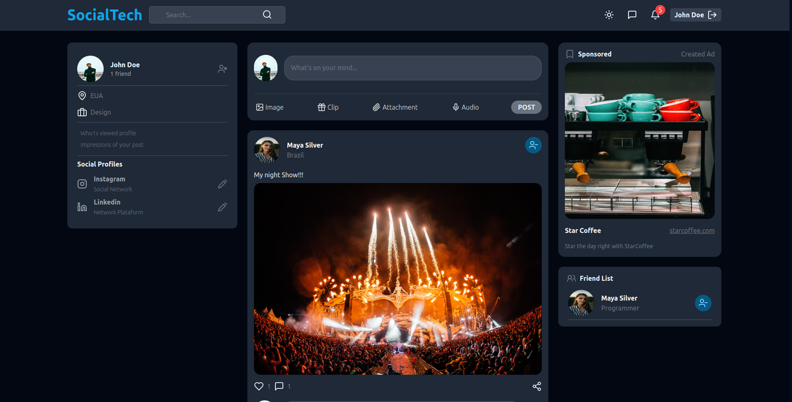
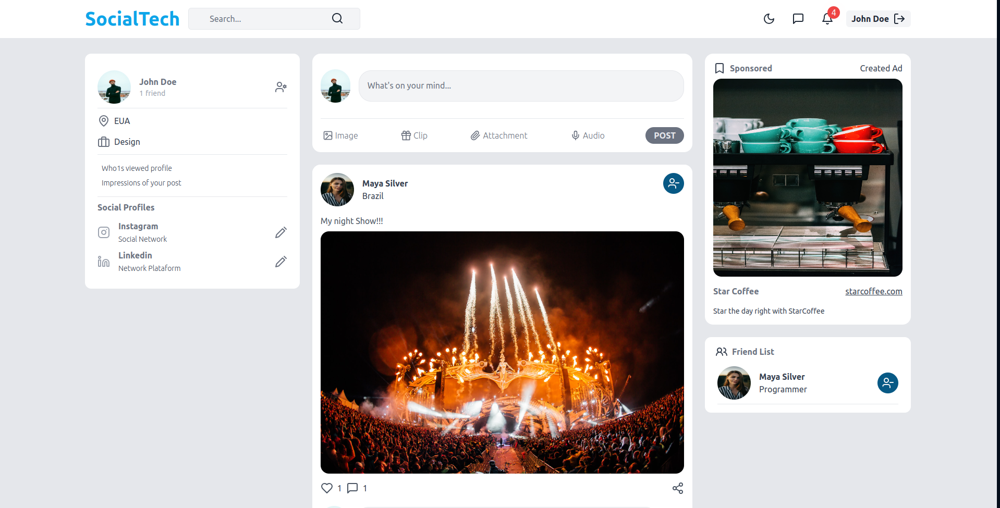
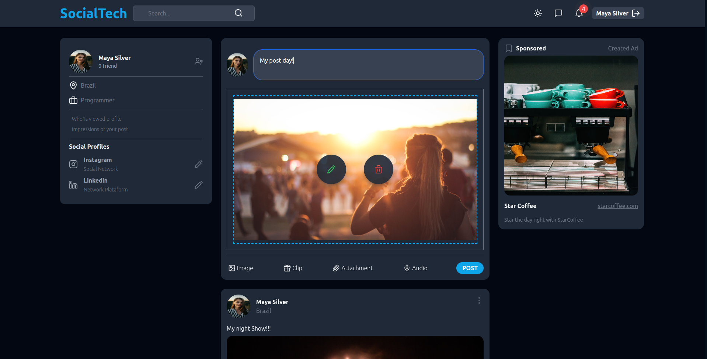
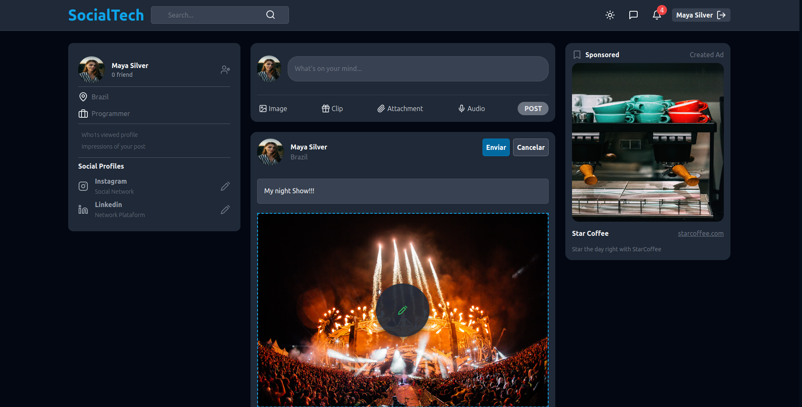
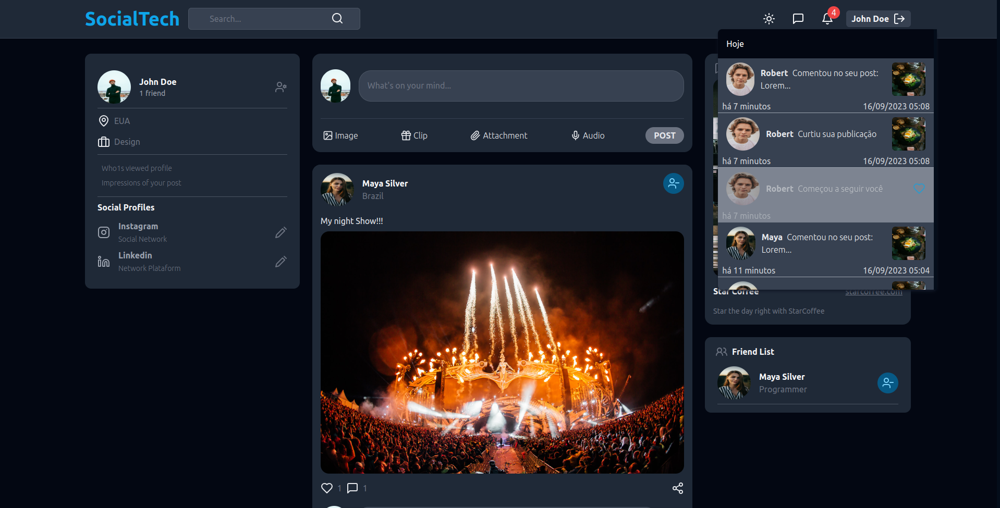
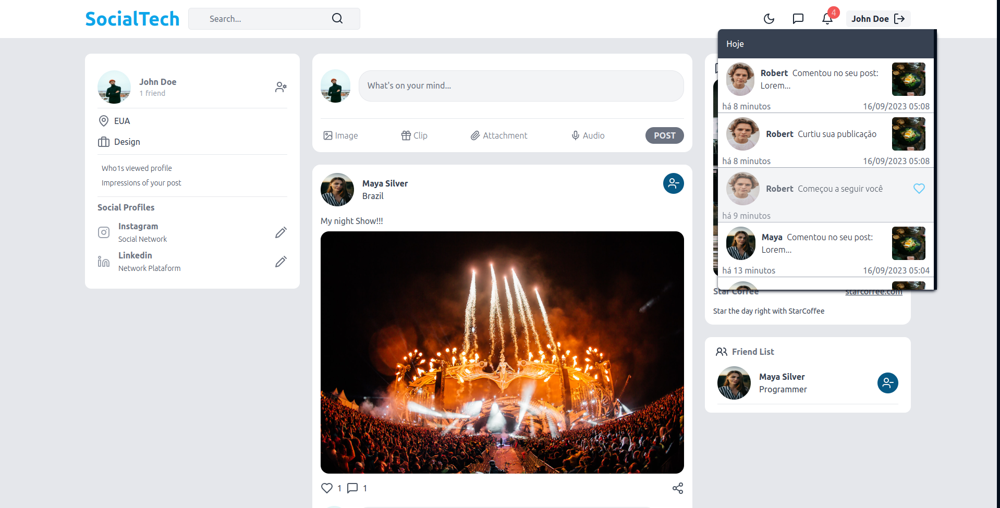
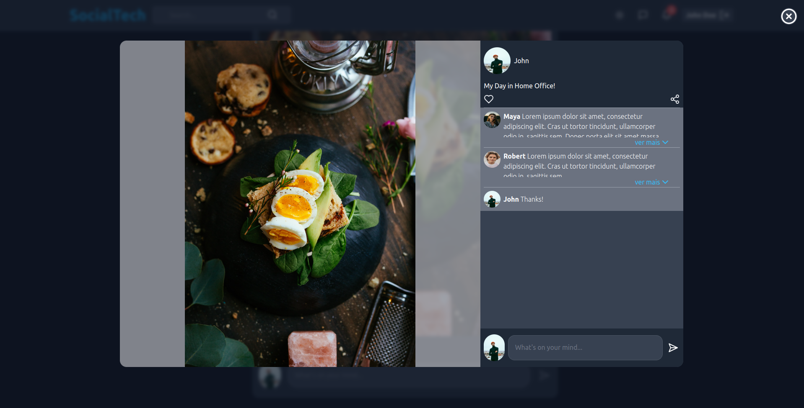
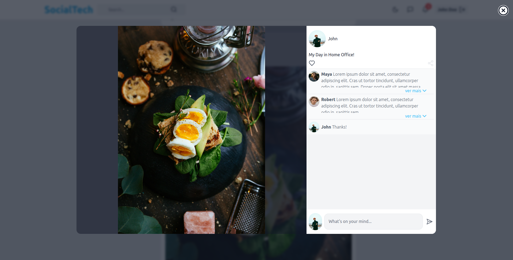

# SocialTech

## Projeto desenvolvido em React e NodeJs

### Cadastrao de usuário
<h1>
    
</h1>

<h1>
    
</h1>

### Página inicial e Modo escuro

<h1>
    
</h1>

<h1>
    
</h1>

<h1>
    
</h1>

## Criação de post

<h1>
    
</h1>

## Edição de post

<h1>
    
</h1>

## Notificações
<h1>
    
</h1>

<h1>
    
</h1>

# Modal dos Poste com exibição de comentários

<h1>
    
</h1>

<h1>
    
</h1>

### **Funcionalidades feitas e futuras**

- [x] Página de perfil
- [x] modal do post com comentários
- [x] Autenticação
- [x] Notificações
- [ ] Página do chat

Funções feitas:

- [x] Ações do usuário:
Fazer e desfazer amizade, curtir e descurtir post

- [x] Post:
Criar, excluir, editar

- [x] Comentário:
criar e deletar comentário

- [x] Notificação:
Redireciona para o post comentado ou curtido e redirecionar para o perfil do seguidor

- [ ] Chat

OBS: 

:warning: Projeto em andamento 
